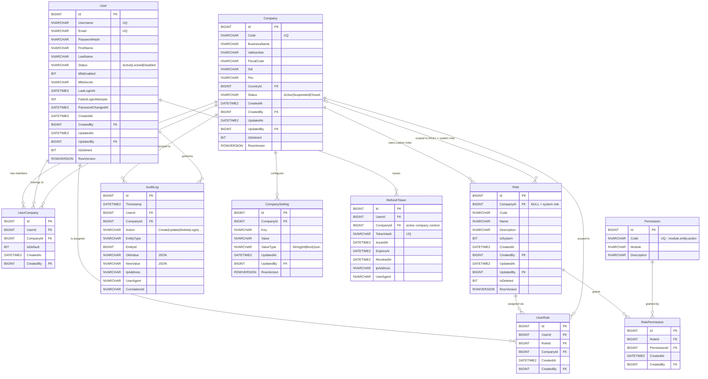

# ERD — Core Platform

**Modulo**: Autenticazione, autorizzazione, multi-tenant, audit
**MVP Fase**: 1
**Owner**: Database Architect Agent

## Note di design

- **Multi-tenant model**: la relazione `User ↔ Company` è many-to-many tramite `UserCompany`. Un utente può accedere a più aziende (es. commercialista, gruppo aziendale). Il contesto attivo (Company corrente) è scelto al login e propagato in `RefreshToken.CompanyId`.
- **Ruoli di sistema vs custom**: `Role.CompanyId` è nullable: NULL = ruolo di sistema (Admin, Manager, User, ReadOnly) visibile a tutte le aziende; valorizzato = ruolo custom locale al tenant.
- **Permission**: catalogo globale immutabile, definito via seed migration. Naming `module.entity.action` (es. `sales.order.create`, `anagraphics.customer.read`).
- **AuditLog**: append-only, niente `IsDeleted`/`RowVersion`/`UpdatedAt`. Vedi `schema-design.md` §3.8 per dettagli immutabilità.
- **PasswordHash**: BCrypt (cost ≥ 12) o Argon2id; il tipo SQL è `NVARCHAR(255)`. Lo schema non vincola l'algoritmo.
- **MfaSecret**: cifrato applicativo (AES-GCM con master key da Key Vault); SQL salva il cipher text in `NVARCHAR(255)`.
