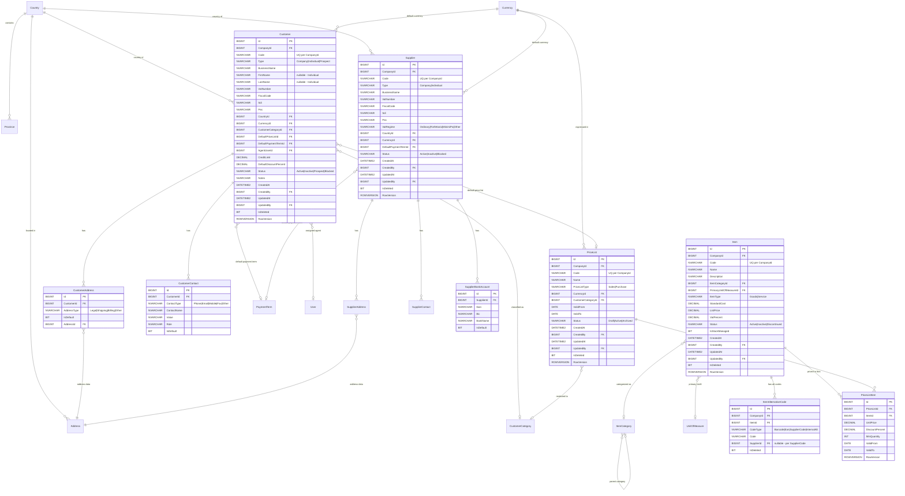

# ERD — Anagrafiche

**Modulo**: Clienti, Fornitori, Articoli, Listini, Categorie, lookup geografici
**MVP Fase**: 2
**Owner**: Database Architect Agent

## Note di design

- **Address normalizzato**: tabella `Address` (vedi `schema-design.md`) condivisa fra `CustomerAddress` e `SupplierAddress` per evitare duplicazione e centralizzare validazioni geografiche (Country, Province).
- **Customer/Supplier indipendenti**: niente eredità o tabella `BusinessPartner` unica — i due workflow divergono presto (regime IVA, dati bancari, agenti, ecc.).
- **`PriceListItem.ValidFrom`** consente versioning del prezzo nel tempo (es. ribasso stagionale). Il prezzo "attivo" è la riga con `ValidFrom ≤ today < ValidTo` o `ValidTo IS NULL`.
- **Prezzi speciali per cliente (US-136)**: rappresentati come listino dedicato `PriceList(PriceListType='Sales')` legato al cliente via `Customer.DefaultPriceListId` oppure tramite tabella `CustomerSpecialPrice` (vedi schema design §4.6).
- **Lookup geografici (`Country`, `Province`, `Currency`)**: globali, niente `CompanyId`, niente `IsDeleted` (gestiti via seed migration, modifiche solo lato sviluppo).
