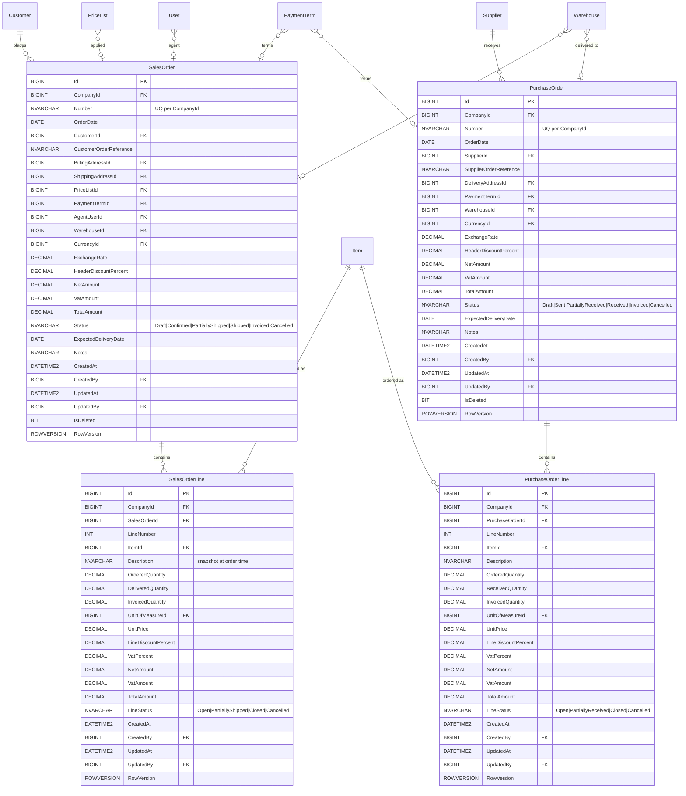

# ERD — Transactions (MVP minimale)

**Modulo**: Ordini di vendita e acquisto (struttura minima per validare schema)
**MVP Fase**: 4 (Vendite) / 3 (Acquisti) — **schema progettato in MVP, implementato in fasi successive**
**Owner**: Database Architect Agent

> **Nota**: il presente ERD è incluso per validare che il modello multi-tenant + audit + concorrenza regga sui workflow transazionali (cfr. workflow `ciclo-attivo.md`, `ciclo-passivo.md`). L'implementazione applicativa è fuori scope MVP. Estensioni (DDT, Fattura, NotaCredito) saranno aggiunte in fasi 3-4.

## Note di design

- **`Number` business vs `Id` tecnico**: `Number` è la numerazione visibile all'utente (es. `2026/000123`), univoca per CompanyId; `Id` è la PK tecnica. Numerazione gestita da un servizio `INumberingService` con sequenze per anno/tipo documento.
- **Snapshot prezzi/descrizione su riga**: `UnitPrice`, `VatPercent`, `Description` sono copiati dall'`Item` al momento della creazione riga — gli aggiornamenti master non devono retroattivamente cambiare gli ordini emessi.
- **`OrderedQuantity` vs `DeliveredQuantity` vs `InvoicedQuantity`**: i tre contatori abilitano stati intermedi (`PartiallyShipped`, `PartiallyReceived`). Gestiti applicativamente quando si introducono DDT e Fattura.
- **`HeaderDiscountPercent`**: sconto a livello testata aggiuntivo (oltre agli sconti riga); applicato in calcolo netto totale documento. Logica di calcolo nel domain layer, non in DB.
- **`CompanyId` ridondato su `*Line`**: i record figli portano `CompanyId` per consentire query filtrate per tenant senza join, e per supportare row-level security future. Constraint check: `*Line.CompanyId = parent.CompanyId` (enforced applicativamente; trigger evitato in MVP).
- **`Status` come stringa**: rappresentato come `NVARCHAR(32)` con `CHECK` constraint dei valori validi. Alternativa enum int rifiutata per leggibilità in tooling SQL e in audit log JSON.
