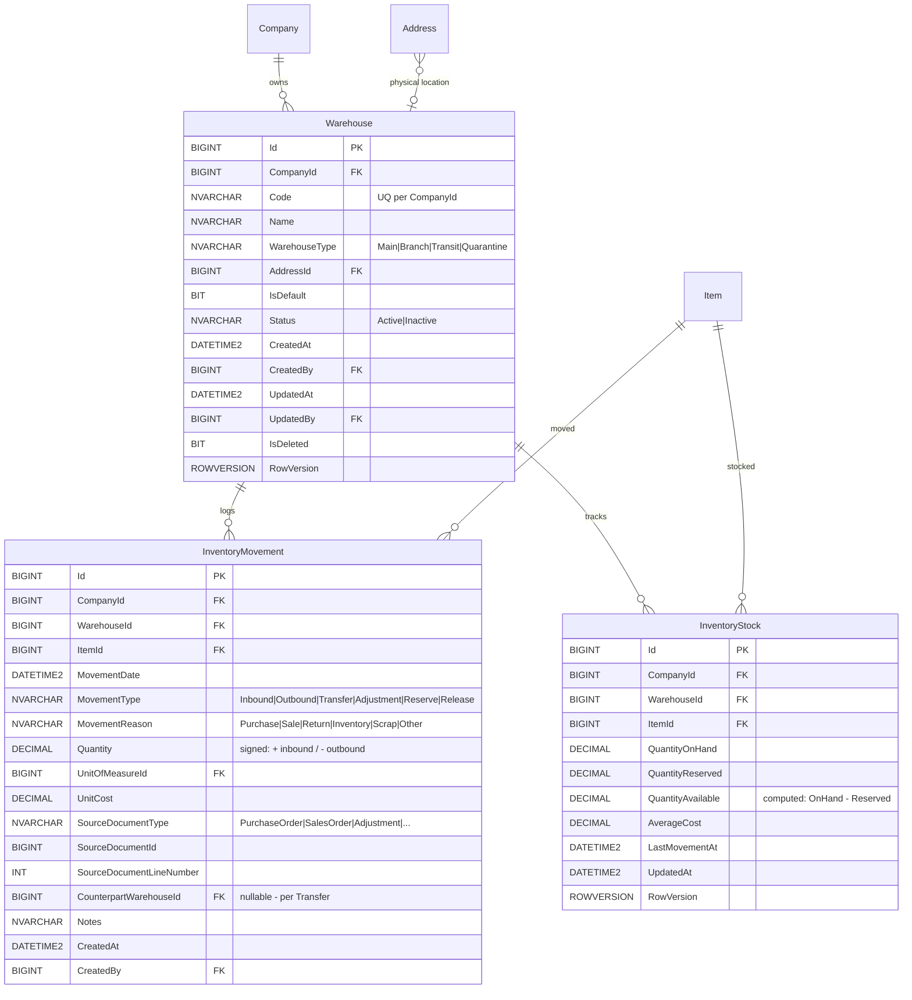

# ERD — Inventory (MVP minimale)

**Modulo**: Magazzino base — depositi, movimenti, stock corrente
**MVP Fase**: 5 — **schema progettato in MVP, implementazione completa in fase 5**
**Owner**: Database Architect Agent

> Lo schema include solo le entità essenziali per validare il pattern (movimenti append-only + stock aggregato). Estensioni (lotti, ubicazioni, seriali, conta fisica) sono fuori scope MVP.



## Note di design

### Pattern append-only + aggregato

- **`InventoryMovement`** è **append-only**: niente `UpdatedAt`, niente `IsDeleted`, niente `RowVersion`. Una correzione si registra come nuovo movimento di tipo `Adjustment`. Questo garantisce ricostruibilità completa dello stock da log (event sourcing minimale).
- **`InventoryStock`** è un **aggregato derivato** mantenuto in sync per performance:
  - Aggiornato dal domain service ad ogni `InventoryMovement` (transazione DB unica: insert movement + upsert stock).
  - `RowVersion` per evitare race condition su update concorrenti dello stesso item+warehouse.
  - Job di **rebuild periodico** (`usp_RebuildInventoryStock`) riconcilia da `InventoryMovement` come safety net e per warm-start dopo recovery.
- **Constraint d'integrità**: `UQ_InventoryStock(CompanyId, WarehouseId, ItemId)` garantisce singola riga aggregato.

### Quantità con segno

`InventoryMovement.Quantity` è signed: positivo per movimenti in entrata, negativo per uscite. Semplifica la query di rebuild stock: `SUM(Quantity)`. Trade-off accettato: leggibilità delle righe richiede sempre lettura congiunta `MovementType + Quantity`. Il dominio applicativo impone coerenza:
- `MovementType = 'Inbound'` → `Quantity > 0`
- `MovementType = 'Outbound'` → `Quantity < 0`
- `MovementType = 'Transfer'` → due righe collegate via `CounterpartWarehouseId` (out dal source, in al destination)

Enforced via check constraint:
```sql
CHECK (
  (MovementType IN ('Inbound','Reserve','Release') AND Quantity >= 0)
  OR (MovementType IN ('Outbound') AND Quantity <= 0)
  OR (MovementType IN ('Transfer','Adjustment')) -- segno libero
)
```

### Reserve/Release

- `Reserve` aumenta `InventoryStock.QuantityReserved` (alla conferma ordine vendita).
- `Release` la diminuisce (alla cancellazione ordine o all'evasione DDT, che poi genera `Outbound`).
- `QuantityAvailable` è una computed column persistente: `QuantityOnHand - QuantityReserved`.

### Costo medio ponderato

`InventoryStock.AverageCost` è aggiornato sui movimenti `Inbound` con la formula:
```
NewAvg = (OldQty * OldAvg + InQty * InCost) / (OldQty + InQty)
```
Logica applicativa nel domain service `InventoryCostingService`. In MVP **un solo metodo di valorizzazione** (media ponderata mobile). FIFO/LIFO post-MVP.

### Riferimento al documento di origine

`SourceDocumentType` + `SourceDocumentId` + `SourceDocumentLineNumber` formano un riferimento "soft" al documento che ha generato il movimento (ordine, DDT, fattura, rettifica). **Non FK formale**: il tipo di documento varia (polymorphic association), e gestirlo via FK multiple aggiungerebbe nullabilità e complessità senza benefit. La join è fatta applicativamente o via view dedicate.
