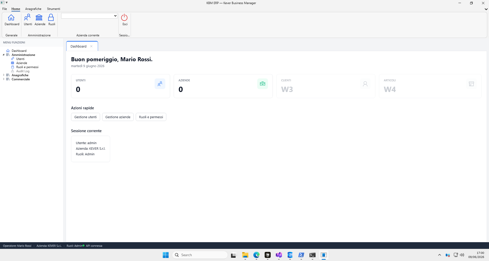
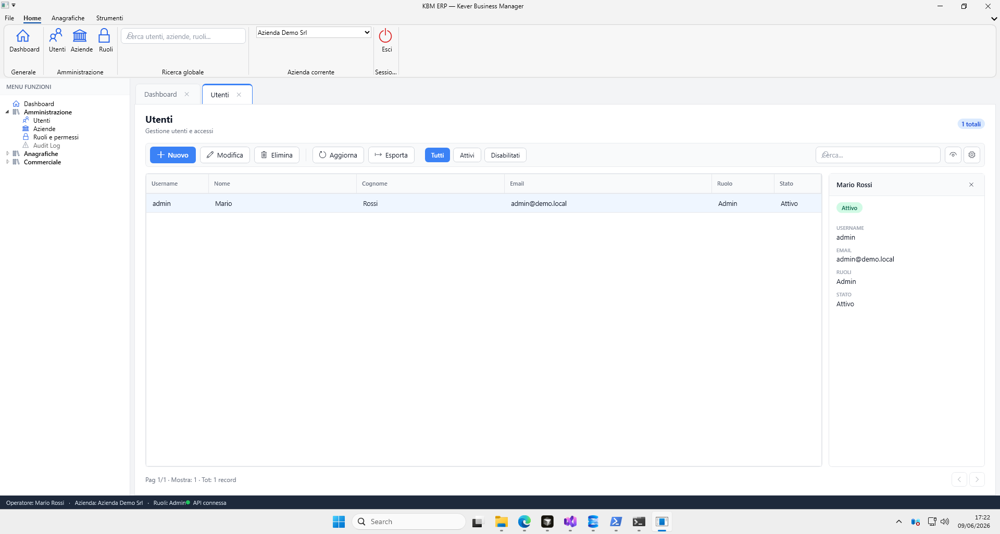

# KBM — Shell Architecture (pattern gestionali enterprise)

**Riferimento**: `guidelines.md`, `style-guide.md`, screenshot `assets/shell-preview.png`
**Modello replicato**: **NTS Business Cube/NET**, **Zucchetti Mago.net/Mago4**, **Zucchetti Ad Hoc**, **SAP GUI** — chrome a **ribbon Office + menu ad albero + documenti MDI**.



## Scouting (giugno 2026)

Caratteristiche comuni verificate sui gestionali di riferimento:

- **Business NET/Cube** (NTS): navigazione tramite **menu ad albero** "a scelte successive"; intestazione con azienda-database / ditta / operatore; funzione "Passa a…" per le finestre aperte; Cube evolve in .NET con toolbar configurabile, Wings laterali e tiles.
- **Mago.net / Ad Hoc** (Zucchetti): **ribbon Office** (tab + gruppi con bottoni a icona grande), area documenti a finestre/tab.
- Costante: **densità con chiarezza**, la **griglia dati è la superficie di lavoro** (header sticky, allineamento per tipo, sort/filtri in testata), **command bar** prominente, navigazione search-first.

## Anatomia KBM (telaio applicativo)

Implementato con **Fluent.Ribbon 11** (ribbon Office nativo per WPF .NET 8):

| Zona | Ruolo |
|------|--------|
| **Ribbon** (Fluent) | Tab Home/Anagrafiche/Strumenti, gruppi con bottoni icona grande; Backstage (menu File); QuickAccess |
| **Menu ad albero** (TreeView 250px) | Moduli a scelte successive (stile Business NET); click apre il documento |
| **Document area** (TabControl) | **Multi-tab MDI**: ogni funzione apre un documento chiudibile, de-duplicato |
| **Status bar** | Operatore · Azienda (ditta) · Ruoli · stato connessione API |

### Pattern multi-tab (MDI moderno)

Cuore dell'esperienza enterprise (Business Cube / Mago / SAP):

1. **Una funzione = un tab** — cliccando “Utenti” nel menu si apre il documento *Utenti* in un tab.
2. **De-duplicazione** — riaprire una funzione già aperta porta in primo piano il tab esistente (no duplicati).
3. **Tab chiudibili** — ogni tab ha la `✕`; più documenti aperti contemporaneamente per lavorare in parallelo.
4. **Tab attivo evidenziato** — bordo superiore accent + sfondo bianco (pattern document tab).
5. **Empty state** — area vuota guida l'utente al menu quando nessun documento è aperto.

### Perché funziona

1. **Moduli in sidebar, funzioni nei tab** — l'utente pensa “Vado in Amministrazione”, poi apre più documenti.
2. **Multi-tasking reale** — confronto Clienti ↔ Articoli ↔ Utenti senza perdere il contesto (no finestre MDI caotiche).
3. **Lista standardizzata** — stessa toolbar (Nuovo/Modifica/Elimina/Esporta) su ogni entità.
4. **Contesto azienda in top bar** — multi-tenant esplicito (pattern TeamSystem / Ad Hoc multi-ditta).
5. **Status bar informativa** — feedback operazioni senza modali (pattern SAP status line).

## Mappa moduli KBM (MVP)

```
Home (HOME) · Dashboard (DASH)
Amministrazione
  ├─ Utenti (UTE)
  ├─ Aziende (AZI)
  ├─ Ruoli e permessi (RUO)
  └─ Audit Log (AUD)            → disabilitato (placeholder)
Anagrafiche
  ├─ Clienti (ANACL)
  ├─ Fornitori (ANAFO)
  └─ Articoli (ANART)
Acquisti
  ├─ Richieste di acquisto (RDA)
  └─ Richieste di offerta (RDO)
Commerciale
  └─ Listini (LIST) | Vendite (VEN) | Acquisti (ACQ) | Magazzino (MAG)  → disabilitati (placeholder)
```

## Selezione azienda al login (stile Business Cube)

Riferimento NTS: [La scelta dell'operatore](https://servizi.ntsinformatica.it/BusHelpWs/helpnet2017sr5/html/bs--scop.htm).

- Dopo l'autenticazione, l'API risponde con `RequiresCompanySelection = true` e l'elenco delle aziende attive associate all'operatore (anche **una sola**): la scelta dell'azienda è **sempre esplicita**.
- Il client mostra una **seconda modale** (`CompanyPickerWindow`) con badge codice azienda + ragione sociale e il nome operatore in intestazione. Solo dopo la conferma si effettua il login definitivo con `companyId` e si apre la shell.
- L'azienda di lavoro è **fissata per la sessione**: la command bar mostra l'azienda corrente come **badge in sola lettura** (niente più switch al volo, che rischiava di far operare sull'azienda sbagliata). Per cambiare azienda si esce e si riaccede.

Implementazione: `AuthService.LoginAsync` (`!CompanyId ⇒ richiede selezione`), `LoginWindow.xaml.cs`, `CompanyPickerWindow.xaml(.cs)`, badge azienda in `ShellWindow.xaml` (`CompanyText`).

## Menu ad albero: codici modulo + ricerca

Riferimento NTS: [Il menu principale](https://servizi.ntsinformatica.it/BusHelpWs/helpnet2017sr5/html/pc03.htm).

- Ogni funzione ha un **codice mnemonico** (campo `Code` in `NavFeature`), mostrato nell'albero **tra parentesi in font piccolo/muted** accanto al nome: es. Clienti **(ANACL)**, Fornitori **(ANAFO)**, Articoli **(ANART)**, Richieste di acquisto **(RDA)**, Richieste di offerta **(RDO)**, Utenti **(UTE)**, Aziende **(AZI)**, Ruoli **(RUO)**.
- Sopra l'albero c'è un **campo di ricerca modulo**: digitando si **filtra** l'albero per nome o codice (espandendo i gruppi che contengono match); **INVIO** apre direttamente il modulo se il testo corrisponde a un codice esatto o individua un'unica funzione; **ESC** (o la `✕`) pulisce il filtro.

Implementazione: `NavigationRegistry` (`Code`, `AllFeatures`, `FindByCode`), `ShellWindow.xaml` (`NavSearchBox`), `ShellWindow.xaml.cs` (`ApplyNavFilter`, `NavSearchBox_PreviewKeyDown`, header con codice in `BuildHeader`).

## Maschere stile Business Cube (comandi + navigatore record)

Riferimento NTS: [Le maschere in Business](https://servizi.ntsinformatica.it/BusHelpWs/helpnet2017sr5/html/pc05.htm) — barra comandi con tasti rapidi e navigatore record.

- **Tasti rapidi standard** (mappati come in Business, con hint nei tooltip):
  - Liste (`ListPageView`): **F2** Nuovo · **F3** Modifica/Apri · **F4** Elimina/Disabilita · **F5** Aggiorna · doppio click = apri.
  - Editor documento/anagrafica (`FormShortcuts`): **F9** Salva · **F6** Stampa · **ESC** Esci/Annulla.
  - Navigatore record: **Ctrl+P** primo · **Ctrl+R** precedente · **Ctrl+S** successivo · **Ctrl+U** ultimo.
  - Le scorciatoie della lista non scattano mentre si digita in un campo (ricerca/filtro/edit in-line), per non interferire con l'input.
- **Navigatore record** (footer della lista): pulsanti primo/precedente, indicatore **"N / totale"** (es. `1 / 196`) e successivo/ultimo, che spostano la selezione nella griglia filtrata — replica del contatore record di Business Cube. Attivo sulle liste dense basate su `FilterableGrid` (Clienti, Fornitori, Articoli, RDA, RDO).
- **Toolbar comandi a icone coerenti** (`IconCatalog`): ogni funzione usa la stessa icona/etichetta in tutto il gestionale; i comandi sono configurabili (mostra/nascondi) e persistiti per pagina.

Implementazione: `Controls/ListPageView.xaml(.cs)` (toolbar con `Key` scorciatoia, `AttachRecordNavigator`, `UpdateRecordNavigator`, `OnPreviewKeyDown`), `Controls/FilterableGrid.cs` (`MoveFirst/Previous/Next/Last`, `CurrentIndex`), `Controls/FormShortcuts.cs` (F9/F6/ESC sugli editor).

## Funzionalità comuni Cube (personalizzazione griglie, messaggi popup)

Riferimento NTS: [Nuove funzionalità comuni CUBE](https://servizi.ntsinformatica.it/BusHelpWs/helpnet2017sr5/html/pc09.htm).

### Personalizzazione griglie + Layout corpo

Replica della maschera *Personalizzazione griglie* di Business: per ogni griglia densa l'utente può scegliere **colonne visibili**, **larghezza** (px, 0 = automatica), **ordine** e salvare più **layout nominati** (es. `Standard`, `Qtà / Prezzo / Valore`). Il layout attivo è selezionabile al volo dalla command bar (combo *Layout*), come il selettore **Layout corpo** sulle wings di Cube.

- **Dove**: liste basate su `FilterableGrid` (Clienti, Fornitori, Articoli, RDA, RDO) tramite `ListPageView.AttachPersonalization(grid, gridId)`; corpo documenti RDA/RDO (`pr-lines`, `rfq-lines`) tramite il pulsante *Layout corpo* nella banda RIGHE.
- **Dialog**: `GridCustomizeWindow` (chrome corporate) — checkbox Visibile, larghezza, riordino su/giù, CRUD dei layout, "Predefinito" (reset).
- **Persistenza**: per-griglia in `%AppData%/KBM/grid-<gridId>.json` (`GridLayoutStore` via `UiSettings.Save<T>/Load<T>`).
- **API griglia**: `FilterableGrid.EnablePersonalization(id)`, `OpenPersonalization(owner)`, `SetActiveLayout(name)`, `LayoutNames`, `ActiveLayout`, evento `LayoutsChanged`.

### Funzioni comuni delle griglie (menu colonna, trova colonna, congela, export)

Riferimento NTS: [Le griglie in Business](https://servizi.ntsinformatica.it/BusHelpWs/helpnet2017sr5/html/pc07.htm). Tutte le griglie dense (`FilterableGrid`) condividono:

| Funzione | Attivazione | Comportamento |
|----------|-------------|---------------|
| **Menu colonna** | tasto destro sull'intestazione | Ordina asc/disc, rimuovi ordinamento, cancella filtro colonna / tutti i filtri, congela/libera colonna, trova colonna, **Esporta** (Excel/CSV/HTML), Personalizza griglia |
| **Ordinamento** | click sul nome colonna; **SHIFT+click** per multi-colonna (nativo DataGrid) | Asc/Disc; il menu colonna imposta ordinamento singolo |
| **Filtri per colonna** | riga filtro sotto l'intestazione | Filtro testuale incrementale (già presente); cancellabile da menu |
| **Congela colonna** | menu colonna | Blocca a sinistra le colonne fino a quella scelta (`FrozenColumnCount`), non scorrono in orizzontale |
| **Trova colonna** | **Ctrl+\\** o voce di menu | Pannello a destra con ricerca: elenca le colonne visibili, doppio click/Invio porta la colonna in vista |
| **Esportazione** | menu colonna → Esporta | Genera sul Desktop **Excel `.xlsx`** (SpreadsheetML via `System.IO.Packaging`, senza dipendenze), **CSV** (UTF‑8 BOM, `;`) o **HTML** (tabella stilizzata) dei record filtrati/ordinati e colonne visibili, poi apre il file; conferma con toast |

Implementazione: `Controls/FilterableGrid.cs` (`BuildColumnContextMenu`, `SortColumn/RemoveSort`, `ClearColumnFilter/ClearAllFilters`, `ToggleFreeze`, `ToggleFinder`/pannello *Trova colonna*, `Export`), `Services/GridExporter.cs` (xlsx/csv/html). Le esportazioni rispettano il **layout attivo** (solo colonne visibili, nell'ordine impostato) → integrazione diretta con la *Personalizzazione griglie*.

### Messaggi popup (toast)

Notifiche non bloccanti in basso a destra (sostituiscono i `MessageBox` informativi), con accent colore per tipo (Info/Success/Warning/Error), auto-dismiss e chiusura al click.

- `Services/ToastService.cs` (`Info/Success/Warning/Error`); host `ItemsControl` (`ToastHost`) montato nella `ShellWindow` e inizializzato con `ToastService.Initialize(ToastHost)`.
- Usato per: conferma applicazione layout griglia, salvataggio documenti (es. RDA). Estendibile ad altri esiti operativi.

## Pattern vista Lista (CRUD)

Ordine fisso (come wireframe 03):

1. **Page header** — titolo + conteggio record
2. **Toolbar** — azioni primarie a sinistra
3. **Quick filters** — pill [Tutti] [Attivi] …
4. **Search** — campo ricerca + Filtri avanzati (fase 2)
5. **DataGrid** — zebra, 32px righe, sort, selezione
6. **Pagination** — server-side, default 25

## Pattern vista Dashboard

- Saluto contestuale + KPI cards (4 colonne)
- Azioni rapide (bottoni secondari)
- Ultimi accessi (mini-griglia)
- Notifiche sistema (lista compatta)

## Implementazione WPF

| Concetto | File |
|----------|------|
| Shell (RibbonWindow + TreeView + TabControl) | `src/KBM.Client/ShellWindow.xaml(.cs)` |
| Ribbon | Fluent.Ribbon 11 (NuGet) |
| Modello documento tab | `src/KBM.Client/Controls/DocumentTab.cs` |
| Command (chiusura tab) | `src/KBM.Client/Controls/RelayCommand.cs` |
| Design tokens (palette/typografia) | `src/KBM.Client/Themes/KbmColors.xaml` |
| Tema controlli (Button/ComboBox/TextBox/ScrollBar/DataGrid) | `src/KBM.Client/Themes/KbmControls.xaml` |
| Stili shell (doc tab, command bar) | `src/KBM.Client/Themes/KbmShell.xaml` |
| Vista lista base | `src/KBM.Client/Controls/ListPageView.xaml` |
| Dashboard | `src/KBM.Client/Views/DashboardView.xaml` |
| Liste admin | `src/KBM.Client/Views/UsersView.xaml`, `CompaniesView`, `RolesView` |

## UX avanzata (wave Cube)

Funzionalità ispirate a Business Cube / Mago, implementate sopra `ListPageView` e la shell:



| Funzione | Dove | Comportamento |
|----------|------|---------------|
| **Wings** (pannello contestuale) | `ListPageView` (colonna destra 300px) | Selezionando una riga mostra il dettaglio del record (campi label/valore + badge stato). Toggle con il bottone vista nella command bar. `EnableWings()` + `SetWingDetail(title, fields, badge)` |
| **Dettaglio record** | Wings | Master-detail: la griglia è la lista, le Wings il dettaglio sincronizzato sulla selezione |
| **Toolbar configurabile** | `ListPageView` (gear) | Popup con checkbox per mostrare/nascondere ogni comando; preferenze persistite per pagina in `%AppData%/KBM/toolbar-<pagekey>.json` (`UiSettings`) |
| **Ricerca globale** | Ribbon, gruppo "Ricerca globale" | Cerca (debounce 300ms) su Utenti/Aziende/Ruoli; popup risultati raggruppati; il click apre il modulo e seleziona il record (`OpenTabAndSelect`) |

File chiave: `Controls/ListPageView.xaml(.cs)`, `Services/UiSettings.cs`, `ShellWindow.xaml(.cs)` (ricerca globale + `SearchResult`).

### Tema controlli

Tutti i controlli WPF standard sono **ri-templatati** in `KbmControls.xaml` per evitare il chrome datato di Windows: ComboBox (popup con ombra), TextBox (placeholder + focus accent), ScrollBar (sottile), DataGrid (header sticky, zebra, hover/selezione), CheckBox, Button (default/primary/icon). Il ribbon usa il tema Fluent (Light) di ControlzEx.

### Estendere con un nuovo modulo

1. Aggiungi il `Fluent:Button` nel ribbon e/o un `TreeViewItem Tag="chiave"` nel menu ad albero (`ShellWindow.xaml`).
2. Mappa la chiave in `CreateContent()` (`ShellWindow.xaml.cs`) restituendo `(titolo, UserControl)`.
3. La view eredita command bar/filtri/grid da `ListPageView`.

## Anti-pattern da evitare

- Menu solo con `TextBlock` clickabili senza gerarchia moduli
- Contenuto centrato “welcome” senza breadcrumb/toolbar
- Finestre separate per ogni entità (no MDI caotico in MVP)
- Colori/typography fuori da `style-guide.md`
